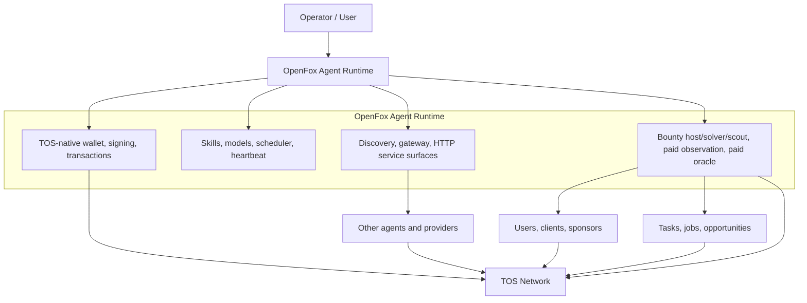
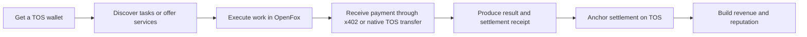

# Bird's-Eye View: OpenFox as a TOS-Native Agent Runtime

This document provides a high-level view of the relationship between OpenFox, TOS, operators, services, and the task economy.

## Core Idea

OpenFox is not just "integrated with another chain."

The goal is to make OpenFox a TOS-native agent runtime that can:

- hold and use a TOS wallet
- receive payments
- execute useful tasks and services
- pay other agents when needed
- generate revenue on TOS

## System Overview

### ASCII Overview

```text
                         Operator / User
                                |
                     configure, run, supervise, earn
                                |
                                v
+------------------------------------------------------------------+
|                    OpenFox Agent Runtime                         |
|                                                                  |
|  1. TOS-Native Capabilities                                      |
|     - wallet / address / signing / transactions                  |
|     - x402 payment client                                        |
|     - settlement receipts / on-chain anchors                     |
|                                                                  |
|  2. Agent Runtime Capabilities                                   |
|     - skills / models / inference                                |
|     - scheduler / heartbeat / daemon                             |
|     - discovery / gateway / HTTP services                        |
|                                                                  |
|  3. Business Capabilities                                        |
|     - bounty host / solver / scout                               |
|     - paid observation API                                       |
|     - paid oracle API                                            |
|                                                                  |
+------------------------------------------------------------------+
           |                         |                         |
           | discover / be found     | provide paid services   | execute tasks
           v                         v                         v
+------------------+      +------------------+      +------------------+
| Other Agents     |      | Users / Clients  |      | Tasks / Jobs     |
| / Providers      |      | / Sponsors       |      | / Opportunities  |
+------------------+      +------------------+      +------------------+
           \                         |                         /
            \________________________|________________________/
                                     |
                                     v
+------------------------------------------------------------------+
|                           TOS Network                             |
|  - wallet balances                                                |
|  - native transactions                                            |
|  - x402 payment verification                                      |
|  - receipts and settlement anchors                                |
|  - future contract-native task and query markets                  |
+------------------------------------------------------------------+
```



## Layered View

### 1. TOS Layer

TOS provides the money and settlement layer:

- wallet accounts and balances
- native transactions
- payment flow through x402
- receipts and settlement anchors
- future contract-native task and query markets

### 2. OpenFox Runtime Layer

OpenFox provides the agent runtime layer:

- local wallet handling and transaction signing
- model-driven execution and automation
- always-on service operation
- agent discovery and gateway connectivity
- task execution and result production

### 3. Service and Marketplace Layer

On top of the runtime, OpenFox can act as:

- a bounty host
- a solver agent
- an opportunity scout
- a paid observation provider
- a paid oracle-style resolver

## Economic Loop

### ASCII Loop

```text
Get a TOS wallet
      |
      v
Discover tasks or offer services
      |
      v
Execute work in OpenFox
      |
      v
Receive payment through x402 or native TOS transfer
      |
      v
Produce result and settlement receipt
      |
      v
Anchor settlement on TOS
      |
      v
Build revenue and reputation
```



## One-Sentence Summary

TOS provides the payment and settlement infrastructure, while OpenFox provides the agent execution runtime; together they form a payable, executable, revenue-generating agent system.
